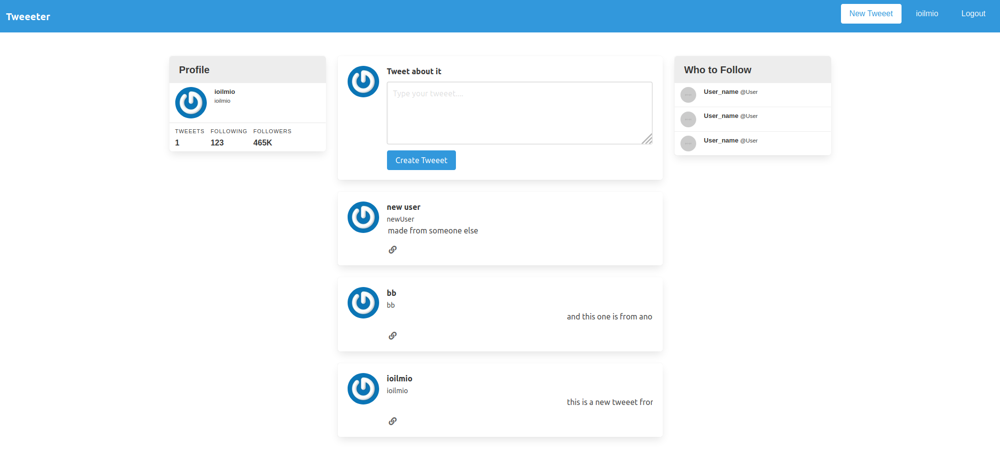
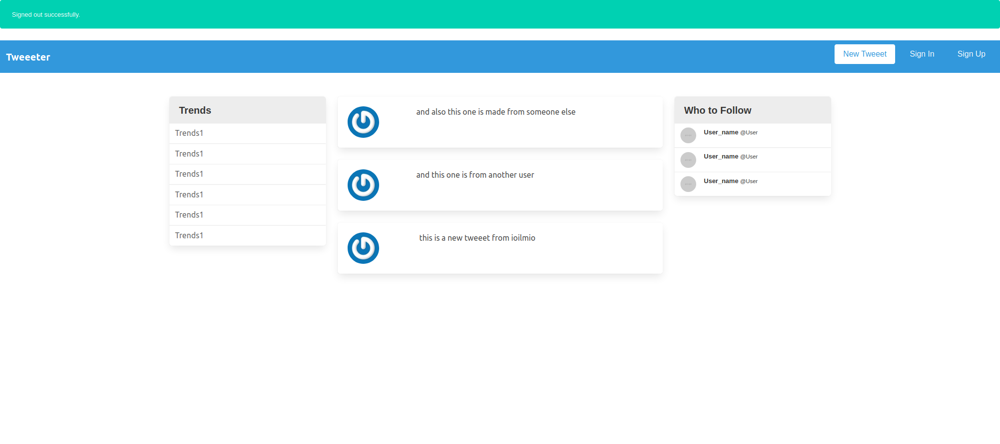

# Twitter Clone for Members-only

> ## This project, is to build an exclusive clubhouse where members can write embarrassing posts about non-members. 

## Here is what you see when you are logged in


## Here is what you see when you are logged out 


### Inside the clubhouse, members can see who the author of a post is but, outside, they can only see the story and wonder who wrote it.

## Built With

- Ruby 2.6.5
- Ruby on Rails 5.2.4.3
- Devise (Authentication) 4.7
- Gravatar image tag (user image)
- Bulma for rails (lightweight css framework)
- Rubocop 0.81.0
- Check Gemfile for all development gem used
- Stylelint 13.2.1
- Nodejs 12.8.3
- npm 6.14.6
## Live Demo

[Live Demo Link](https://livedemo.com)

~~~~~~~~~~~~~~~~~~~~~~~~~~~~~~~~~~~~~~~~

### Prerequisites

#### Have the above version of the software correctly installed on your system.

### Setup
``` git clone git@github.com:ioilmio/TwitterClone.git ```

### Install
#### In your terminal run ```bundle install``` to get all gem installed and ready to use.

#### In your terminal run ```rails db:migrate``` to create tables for users and tweeets.


### Usage
#### Sign up for an account and write some tweeets.

#### Log out and you will not see any users information, just the tweets content

### Deployment

#### Deploy to easily to Heroku following this instructions:
[Deployment for Heroku](https://www.theodinproject.com/courses/ruby-on-rails/lessons/deployment?ref=lnav)


👤 **Illuminato Salvatore**

- Github: [@ioilmio](https://github.com/ioilmio)
- Twitter: [@ioilmio](https://twitter.com/ioilmio)
- Linkedin: [Illuminato Salvatore](https://www.linkedin.com/in/illuminato-salvatore/)


## 🤝 Contributing

Contributions, issues and feature requests are welcome!

Feel free to check the [issues page](https://github.com/ioilmio/TwitterClone/issues).

## Show your support

Give a ⭐️ if you like this project!

## Acknowledgments

- Microverse
- Odin project
- Rails guides
- Rails Documentation 

## 📝 License

This project is [MIT](lic.url) licensed.
